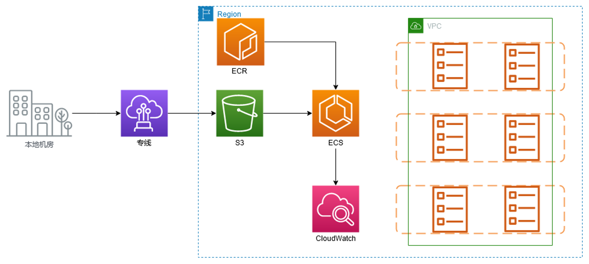
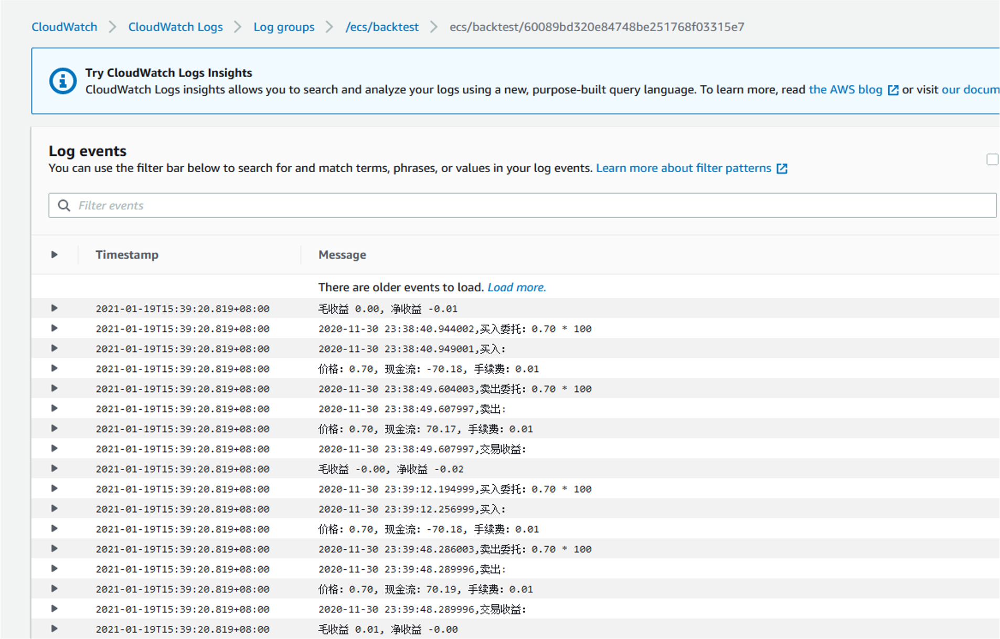
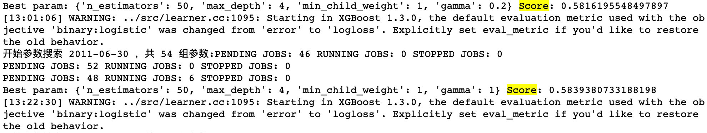

# 金融行业某买方用户高性能计算解决方案

## Architectures
* 行情数据清洗之后，使用该场景进行回测任务，找出分数最高的参数范围
* 适用于需要大量算力的并行计算场景，可以把已有Python代码放到容器中运行
* 使用ECS Fargate提供算力，只按运行时间收费，相对本地环境效率更高，费用更低

## Results
* 运行日志查看

## Scores
* 打分结果查看

